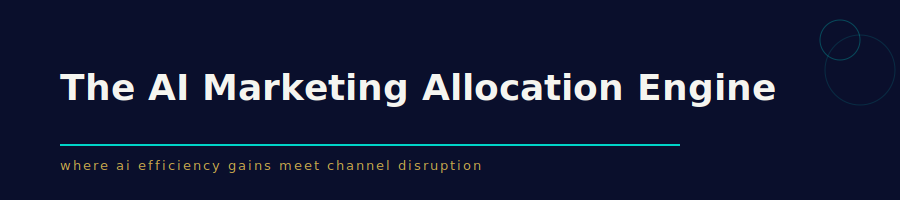
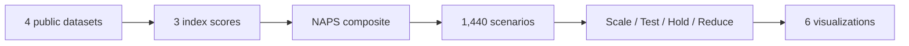
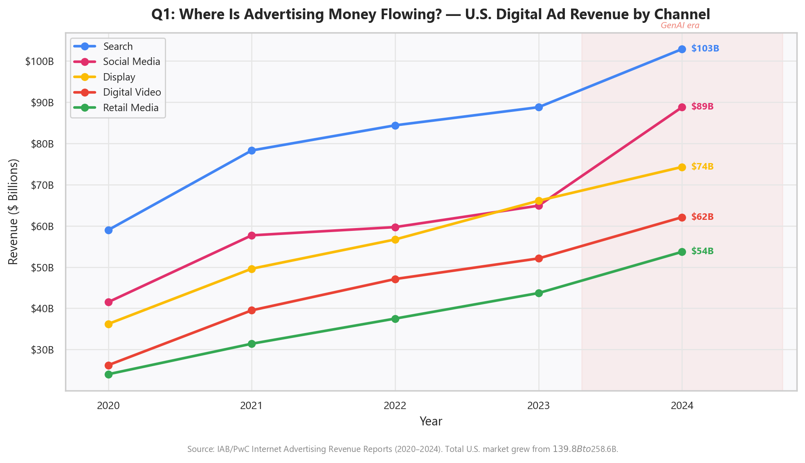
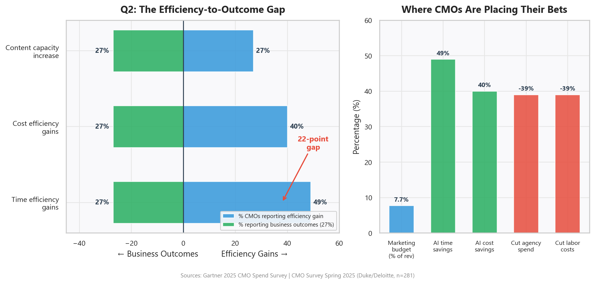
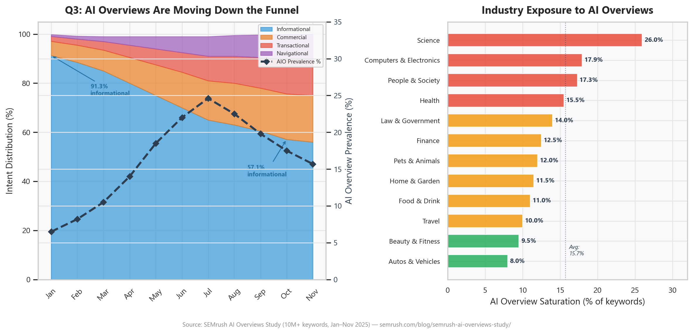
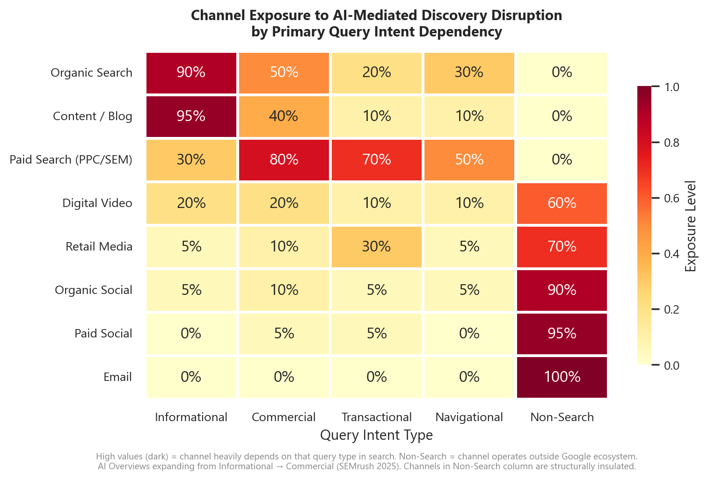
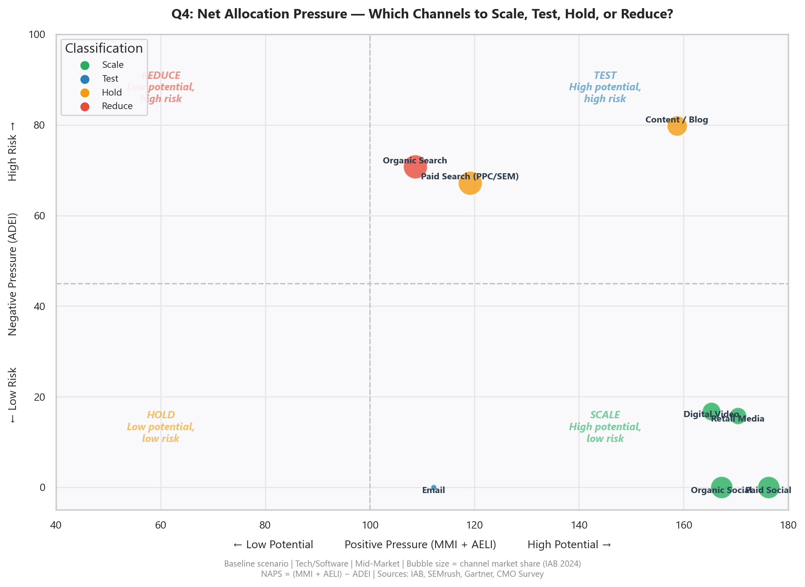
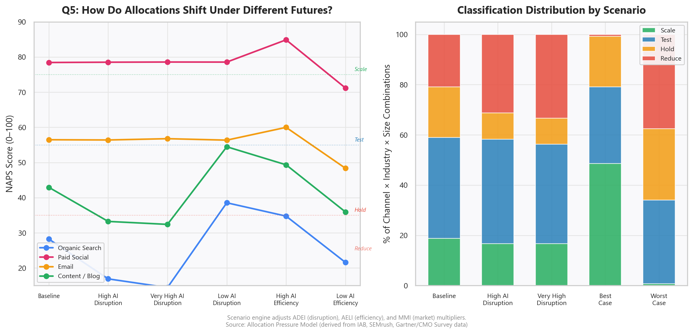

<p align="center">
  
</p>

<p align="center">
  
  
  
  
  
</p>

---

Marketing budgets have flatlined at 7.7% of revenue. CMOs are cutting agencies and headcount to fund AI tools, and 49% report improved time efficiency -- but only 27% see those gains show up in business outcomes. At the same time, Google's AI Overviews are absorbing organic search traffic, with 58.5% of all U.S. searches ending in zero clicks. Most reporting treats these as separate trends. This project builds a **Net Allocation Pressure framework that integrates AI productivity signals with channel disruption data across 1,440 scenarios, classifying 8 marketing channels as Scale, Test, Hold, or Reduce** -- the view that doesn't exist in any standard marketing dashboard.


---

<table width="100%">
<tr>
<td align="center" width="25%" valign="top">
<h1>$258.6B</h1>
<hr>
U.S. digital ad market analyzed
</td>
<td align="center" width="25%" valign="top">
<h1>22pt</h1>
<hr>
efficiency-to-outcome gap
</td>
<td align="center" width="25%" valign="top">
<h1>1,440</h1>
<hr>
scenario combinations modeled
</td>
<td align="center" width="25%" valign="top">
<h1>8</h1>
<hr>
channels classified Scale / Test / Hold / Reduce
</td>
</tr>
</table>

---

## Contents

| **Section** | **What you'll find** |
|---|---|
| [Project snapshot](#project-snapshot) | Quick-glance specs |
| [The problem](#the-problem) | Why AI efficiency and channel disruption must be analyzed together |
| [Data](#data) | 4 datasets from IAB, SEMrush, Gartner, CMO Survey |
| [The framework](#the-framework) | Three indices combined into a Net Allocation Pressure Score |
| [Analysis](#analysis) | 6 visualizations answering 5 strategic questions |
| [Key findings](#key-findings) | Which channels to scale, hold, and reduce |
| [Business impact](#business-impact) | What a CMO does differently with this framework |
| [Reproduce it](#reproduce-it) | Clone, install, run |

---

## Project snapshot

| **Domain** | Marketing analytics, channel strategy |
|---|---|
| **Context** | Data visualization project proposal |
| **Course** | MAX 507 -- Visual Analytics, Stuart School of Business |
| **Tools** | Python, Pandas, Matplotlib, Seaborn, Tableau |
| **Methods** | Composite index modeling, scenario analysis, allocation classification |
| **Data** | 4 datasets -- IAB/PwC, SEMrush, Gartner/CMO Survey, scenario model (1,440 rows) |

---

## The problem

Two forces are hitting marketing budgets at the same time, and most organizations are measuring each in isolation.

**Force 1 -- AI-mediated discovery is altering channel economics.** Google's AI Overviews now appear on 15.7% of tracked keywords, peaking at 24.6% in July 2025. Organic position-1 click-through rates have fallen from 28% to 19% -- a 32% decline. Across all U.S. searches, 58.5% end with zero clicks, rising to 77.2% on mobile. The channels that historically powered growth are losing effectiveness at a measurable rate.

**Force 2 -- AI productivity gains are real but do not automatically translate to growth.** CMOs report 49% time efficiency gains from AI tools. But only 27% see those gains translate into business outcomes -- a 22-point gap. Meanwhile, early GenAI marketing pilots reported 31% ROI in 2023. As those pilots scaled, actual ROI settled at approximately 7%, below the typical 10% cost-of-capital hurdle rate.

| **Force** | **Signal** | **Source** |
|---|---|---|
| Channel disruption | 58.5% of U.S. searches end in zero clicks | SparkToro/Datos, Q1 2025 |
| Channel disruption | Organic CTR dropped 32% (28% to 19%) | GrowthSRC, 200K+ keywords |
| Channel disruption | AI Overviews migrating from informational to commercial queries | SEMrush, 10M+ keywords |
| AI efficiency | 49% report time savings, 27% report business outcomes | Gartner CMO Spend Survey 2025 |
| AI efficiency | GenAI marketing ROI declined from 31% to 7% at scale | IBM/Oxford Economics 2025 |
| Budget pressure | Marketing budgets flat at 7.7% of revenue | Gartner 2025 |

The core problem: CMOs are using AI to produce more content faster and cheaper (Force 2) while deploying that content into channels whose underlying effectiveness is declining (Force 1). The efficiency gains may be partially or entirely absorbed by the declining value of the channels they serve. Whether the net outcome is positive, neutral, or negative depends on the specific channel -- but no standard dashboard combines both forces into a single view.

---

## Data

Four datasets power the framework. Three are public benchmarks providing the calibration anchors. The fourth is a researcher-generated scenario layer that combines the three indices into a composite allocation model.

**1. IAB/PwC Internet Advertising Revenue Reports (2020--2024)**

Five years of U.S. digital advertising revenue by channel -- Search, Social, Display, Video, Retail Media, Audio. This dataset establishes the Market Momentum Index: which channels have sustained growth and increasing share versus which are plateauing. Total market grew from $139.8B to $258.6B over the period.

Source: [IAB Internet Advertising Revenue Reports](https://www.iab.com/topics/ad-revenue/) (annual, free PDF download)

**2. SEMrush AI Overviews impact study (January--November 2025)**

Eleven months of AI Overview prevalence data across 10M+ keywords, segmented by query intent type (informational, commercial, transactional, navigational) and industry vertical. The critical finding: AI Overview triggers shifted from 91.3% informational in January to 57.1% by October, with commercial and navigational queries surging. The disruption is migrating down the funnel.

Source: [SEMrush AI Overviews Study](https://www.semrush.com/blog/semrush-ai-overviews-study/) (10M+ keywords, monthly aggregates)

**3. Gartner 2025 CMO Spend Survey + CMO Survey Spring 2025 (Duke/Deloitte)**

Budget benchmarks (7.7% of revenue), AI productivity metrics (49% time efficiency, 40% cost efficiency, 27% business outcomes), workforce reallocation data (39% cutting agencies, 39% cutting labor to fund AI). The CMO Survey adds industry and company-size segmentation from 281 VP-level respondents, supplemented by FirstPageSage customer acquisition cost benchmarks by channel.

Sources: [Gartner CMO Spend Survey 2025](https://www.gartner.com/en/newsroom/press-releases/2025-05-12-gartner-2025-cmo-spend-survey-reveals-marketing-budgets-have-flatlined-at-seven-percent-of-overall-company-revenue) | [CMO Survey Spring 2025](https://cmosurvey.org/results/spring-2025/) | [FirstPageSage CAC Benchmarks](https://firstpagesage.com/marketing/cac-by-channel-fc/)

**4. Allocation Pressure Scenario Model (researcher-generated)**

A Python-generated scenario grid combining the three public-data indices into 1,440 combinations (8 channels x 6 industries x 3 company sizes x 10 scenario variants). Each combination receives a Net Allocation Pressure Score and a Scale/Test/Hold/Reduce classification. Scenario variants adjust AI disruption level (0.5x--2.5x), AI efficiency assumptions (0.75x--1.25x), and market growth (plus/minus 15%).

Source: [code/01_generate_scenario_model.py](code/01_generate_scenario_model.py)

---

## The framework

The project constructs three indices from the public datasets, then combines them into a single composite score.

<table width="100%">
<tr>
<td align="center" width="33%" valign="top">
<h3>Market Momentum Index</h3>
<hr>
From IAB data: 5-year CAGR and share trajectory per channel<br><br><b>Measures:</b> Where is capital flowing?
</td>
<td align="center" width="33%" valign="top">
<h3>AI Efficiency Leverage Index</h3>
<hr>
From Gartner/CMO Survey: time savings, cost savings, outcome translation<br><br><b>Measures:</b> Where is AI actually working?
</td>
<td align="center" width="33%" valign="top">
<h3>AI Discovery Exposure Index</h3>
<hr>
From SEMrush: AI Overview prevalence, intent migration, search dependency<br><br><b>Measures:</b> Where is AI eating the channel?
</td>
</tr>
</table>

**Net Allocation Pressure Score (NAPS) = (MMI + AELI) -- ADEI**

The composite produces a four-category classification for each channel:

| **NAPS range** | **Classification** | **Strategic posture** |
|---|---|---|
| High positive | **Scale** | Increase investment -- momentum, AI leverage, low disruption |
| Moderate positive | **Test** | Cautiously increase -- signals are mixed, run experiments |
| Near zero | **Hold** | Maintain current allocation -- forces roughly balance |
| Negative | **Reduce** | Decrease investment -- structural headwind that AI efficiency cannot overcome |

---

## Analysis



Each visualization answers one of the five strategic questions the framework is designed to address.

**Visualization 1 -- Where is advertising money flowing?**

Five-year revenue trajectory for each major digital advertising channel from IAB data. Social media's acceleration ($41.5B to $88.8B, +36.7% in 2024) and search's continued dominance ($102.9B) are visible. This feeds the Market Momentum Index.

<p align="center">
  
</p>

**Visualization 2 -- Where is the efficiency-to-outcome gap widest?**

The divergence chart contrasts efficiency gains against business outcomes from the Gartner survey. The 22-point gap between "49% report time savings" and "27% report business outcomes" is the core measurement distortion. The right panel shows how CMOs are funding AI tools -- cutting agency spend (39%) and labor (39%).

<p align="center">
  
</p>

**Visualization 3 -- How exposed are channels to AI-mediated discovery disruption?**

The stacked area chart shows the critical intent migration: informational queries dropped from 91.3% to 57.1% of AI Overview triggers while commercial and navigational queries surged. The industry bar chart ranks verticals by AI Overview saturation -- Science (26.0%) and Computers & Electronics (17.9%) face the highest exposure.

<p align="center">
  
</p>

**Visualization 3b -- Channel exposure heatmap**

Maps the 8 marketing channels against their dependency on each query intent type. Organic Search and Content/Blog are heavily exposed to informational and commercial query disruption. Email, Paid Social, and Organic Social operate entirely outside the search ecosystem.

<p align="center">
  
</p>

**Visualization 4 -- Which channels show net positive vs. net negative allocation pressure?**

The centerpiece of the project. Each channel is plotted by its combined positive pressure (MMI + AELI) against its negative pressure (ADEI). Bubble size reflects 2024 market share. Under baseline conditions for Tech/Software Mid-Market companies: Paid Social and Organic Social classify as Scale (high momentum, zero search exposure). Organic Search and Paid Search classify as Reduce (search-dependent, structural AI disruption).

<p align="center">
  
</p>

**Visualization 5 -- How should allocation posture change under different scenarios?**

Four representative channels tracked across six scenarios. Paid Social remains in the Scale zone across all scenarios (structurally resilient). Organic Search drops deeper into Reduce as AI disruption increases. Email and Content/Blog shift between classifications depending on assumptions -- these are the channels where strategic testing matters most.

<p align="center">
  
</p>

---

## Key findings

The allocation framework reveals that the correct strategic response to AI in marketing is channel-specific, not universal. Treating "AI in marketing" as a single trend produces the wrong answer for most channels.

**1. Social channels are structurally resilient.** Paid Social and Organic Social classify as Scale under baseline and most scenario variants. They have the highest market momentum (social advertising grew from $41.5B to $88.8B in four years), moderate AI efficiency gains, and zero exposure to AI Overview disruption. Capital should flow here.

**2. Search-dependent channels face compounding headwinds.** Organic Search classifies as Reduce across nearly every scenario. The combination of declining CTR (28% to 19%), expanding AI Overviews (now penetrating commercial queries), and high content saturation from AI-generated material creates structural pressure that efficiency gains cannot offset. Paid Search is slightly more resilient (ads still appear alongside AI Overviews) but faces growing risk as commercial AI Overviews expand.

**3. Email is the highest-efficiency, lowest-risk channel.** Email classifies as Test (approaching Scale) with the best efficiency-to-outcome ratio of any channel (45% outcome translation vs. 27% average), zero discovery exposure, and the lowest customer acquisition costs in both B2B ($510) and B2C ($287). It is chronically underinvested relative to its risk-adjusted return.

**4. Content marketing is the trap.** Content/Blog has the highest AI efficiency gains (60% time savings, 65% cost savings) but also the highest discovery exposure and the lowest outcome translation (18%). The efficiency gains are almost entirely absorbed by the channel headwinds. Under baseline conditions it classifies as Hold -- under high disruption scenarios it drops to Reduce.

**5. The 22-point gap is the leading indicator.** The distance between efficiency gains (49%) and business outcomes (27%) is not just a measurement issue -- it signals that AI is producing more of something that is worth less. Until outcome translation catches up to efficiency metrics, CMOs should be skeptical of AI ROI claims that rely only on input metrics.

---

## Business impact

This framework gives marketing leaders a single view that does not exist in any standard dashboard: the interaction between internal AI productivity and external channel disruption, resolved to a channel-level allocation recommendation.

**For the CMO making budget decisions:** The allocation quadrant replaces gut-feel channel rebalancing with a defensible framework. Instead of asking "should we invest more in AI?" the question becomes "which channels benefit from AI investment and which are being undermined by it?" The answer is different for Paid Social (Scale) and Organic Search (Reduce), and the scenario engine shows which recommendations hold across multiple futures.

**For the VP of Growth or Demand Gen:** The channel exposure heatmap identifies where to shift team resources. Organic search and content teams should be redeployed toward channels with lower discovery exposure and higher outcome translation. The Days-to-Value for AI tools varies by channel -- email personalization produces measurable outcomes faster than AI-generated blog content.

**For the CFO evaluating AI marketing ROI:** The 22-point efficiency-to-outcome gap explains why AI marketing investments are underperforming expectations. The 31% pilot ROI declining to 7% at scale is not a failure of implementation -- it reflects the structural interaction between AI efficiency and channel economics. ROI assessment must account for the channel context in which AI tools operate.

The scenario engine transforms this from a static report into a reusable decision tool. As AI Overviews expand or contract, as AI productivity gains mature or plateau, the framework recalculates and the allocation recommendations shift accordingly.

---

## Reproduce it

```bash
git clone https://github.com/sai-seetal-pendyala/AI-Marketing-Allocation-Engine.git
cd AI-Marketing-Allocation-Engine
pip install -r requirements.txt
```

**Generate the scenario model (Dataset 4):**

```bash
python code/01_generate_scenario_model.py
```

**Generate all 6 visualizations:**

```bash
python code/02_generate_visualizations.py
```

All public datasets are included in the [data/](data/) folder. The scenario model script reads from `data/` and outputs `dataset4_allocation_pressure_model.csv`. The visualization script reads all datasets and outputs PNGs to `assets/`.

**Data sources:**

- [IAB/PwC Internet Advertising Revenue Reports](https://www.iab.com/topics/ad-revenue/) (2020--2024)
- [SEMrush AI Overviews Study](https://www.semrush.com/blog/semrush-ai-overviews-study/) (10M+ keywords, Jan--Nov 2025)
- [Gartner 2025 CMO Spend Survey](https://www.gartner.com/en/newsroom/press-releases/2025-05-12-gartner-2025-cmo-spend-survey-reveals-marketing-budgets-have-flatlined-at-seven-percent-of-overall-company-revenue)
- [CMO Survey Spring 2025](https://cmosurvey.org/results/spring-2025/) (Duke/Deloitte, n=281)
- [FirstPageSage CAC Benchmarks](https://firstpagesage.com/marketing/cac-by-channel-fc/)

---

<p align="center">
  Part of <b>Sai Seetal Pendyala</b>'s Analytics Portfolio<br>
  <a href="https://www.linkedin.com/in/sai-seetal-pendyala/">LinkedIn</a> · <a href="https://github.com/sai-seetal-pendyala">GitHub</a>
</p>
